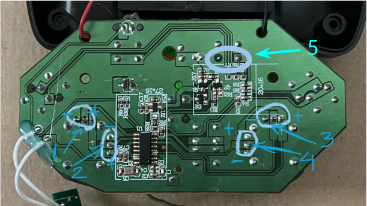
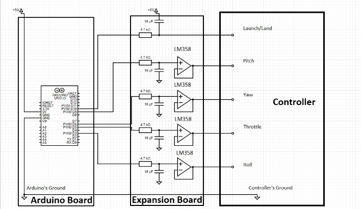
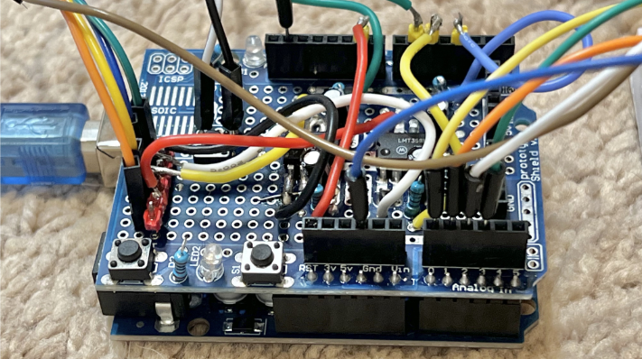

# off-the-shelf-drone-control 
Interfaced an inexpensive drone($18) with Arduino in order to control drone inputs through Arduino IDE.

# Initial Steps: 
* Received the drone (sky viper nano) and Arduino Uno kit
* Installed arduino IDE (integrated development environment) on my laptop
* Tested the drone

[The Sky Viper Nano drone is a lightweight mini drone](https://www.amazon.com/Sky-Viper-Drone-Black-Green/dp/B07G1RJXGF)

# Interfacing: 
* Unscrewed the drone controller
* Identified the joystick connections on the PCB (printed circuit board)
* Measured the voltage for three connections on each joystick potentiometer (3.35v between ends and ~1.68v the middle base in relaxed status)
* Cut the middle bases of joysticks on PCB (because we want to control it ourselves) and soldered wires to the traces that lead to the chip, as well soldered wires to the ground/on-off button connection(don’t need to cut this with cutter) / launch & land connections on the drone controller PCB
* Wrote an Arduino code to generate PWM (pulse-wave modulation) outputs on Arduino’s four output PWM pins

# Drone Controller

* Numbers indicate joystick connections#1 represents roll, #2 is pitch, #3 is throttle, #4 is yaw, #5 is land/launch

# Stabilizing and Launching

* Added low-pass RC filters (PWM to DC) and OP-AMPs to Arduino’s 4 PWM outputs
* Added one PWM output in the code for launch/land followed by an RC filter(C connected to 3.35 v) to the new PWM pin.
* After this testing was complete, I wrote a program to control the drone launch/land, throttle, pitch, and yaw through the Arduino IDE
* I was able to make it turn on and ascend/descend with triggering launch/land. Orbit was done using yaw and roll, and speed control was done by pitch. 
* I also saw that adding a pause before landing improves control and makes it more smooth.

# Circuit Schematic + Expansion Board Circuit

# Code Part 1 - Calibrating/Initializing

const int midVoltageInt = 82;  // equivalent to controller_voltage/2 = 1.675 --> 1.675/5.20*255= 82

// calibration:
int throttle_cal = 0.8*midVoltageInt;
int yaw_cal      = 1*midVoltageInt;
int pitch_cal    = 0.78*midVoltageInt;
int roll_cal     = 1.2*midVoltageInt;

int throttle = throttle_cal;  
int yaw      = yaw_cal;  
int pitch    = pitch_cal;  
int roll     = roll_cal;  

// Arduino PWM outputs
int PWMpin_throttle = 5;      // Output to digital pin 5 - Throttle
int PWMpin_yaw      = 6;      // Output to digital pin 6 - Yaw
int PWMpin_pitch    = 9;      // Output to digital pin 3 - Pitch
int PWMpin_roll     = 3;      // Output to digital pin 9 - Roll
int PWMpin_launch   = 10;     // Output to digital pin 10 - Launch/Land

void setup() {
  pinMode(PWMpin_throttle, OUTPUT); // sets the pin as output
  pinMode(PWMpin_yaw, OUTPUT);      // sets the pin as output
  pinMode(PWMpin_pitch, OUTPUT);    // sets the pin as output
  pinMode(PWMpin_roll, OUTPUT);     // sets the pin as output

  writeToPWM(throttle, yaw, pitch, roll); // initialize signals

  analogWrite(PWMpin_launch, 164);  // initialize launch/land button to max V=3.35
}

# Code Part 2 - Takeoff/Orbiting

void loop() {

  // Launch
  analogWrite(PWMpin_launch, 0);  
  delay(200);
  analogWrite(PWMpin_launch, 164);  
   
  //Pause
  throttle = throttle_cal;
  yaw      = yaw_cal;
  pitch    = pitch_cal;
  roll     = roll_cal;
  writeToPWM(throttle, yaw, pitch, roll);
  delay(3000);

  // Orbit
  throttle = throttle_cal;
  yaw      = yaw_cal*2;
  pitch    = pitch_cal*1;
  roll     = roll_cal*1.7;
  writeToPWM(throttle, yaw, pitch, roll);
  delay(10000);

  // Pause
  throttle = throttle_cal;
  yaw      = yaw_cal;
  pitch    = pitch_cal;
  roll     = roll_cal;
  writeToPWM(throttle, yaw, pitch, roll);
  delay(1000)

  // Land
  analogWrite(PWMpin_land, 0);  
  delay(200);
  analogWrite(PWMpin_land, 164);  

 // Stay inactive
  while(true)
  {
    //dummy infinite loop
  }

# Code Part 3 - Functions

void writeToPWM(int throttle, int yaw, int pitch, int roll)
{
  // limit boundaries to [0, 255]
  throttle = setBounds(throttle);
  yaw = setBounds(yaw);
  pitch = setBounds(pitch);
  roll = setBounds(roll);
 
  // Write the new values to PWM outputs:
  analogWrite(PWMpin_throttle, throttle);
  analogWrite(PWMpin_yaw, yaw);  
  analogWrite(PWMpin_pitch, pitch);
  analogWrite(PWMpin_roll, roll);  

  return;
}

int setBounds(int val)
{
  // Keep the val between in [0,255]
  if(val>255)
    val = 255;
  else if(val<0)
    val = 0;

  return(val);
}

# Flight Videos 
[Low Speed With A Large Radius](https://youtube.com/shorts/BE0ayNMGKw4?feature=shared)

[High Speed With A Large Radius](https://youtube.com/shorts/gUoHLjEAiHc?feature=shared)

[Low Speed With A Small Radius](https://youtube.com/shorts/MegWfbtFAbc?feature=shared)

# Abstract

Flying Light Specks Flight Pattern Optimization

Modern day drones typically occupy a significant amount of space, and considerable time must be spent to calibrate the position of drones in order to gain control over location and movement. These drones can then be used to create an immersive visual experience, with each drone equipped with light sources. A more efficient way of achieving this purpose is through miniature drones, which is the idea envisioned with Flying Light Specks (FLSs). An FLS is a micro-drone configured with RGB light sources, programmed for autonomy, and integrated with precision sensors. The purpose of this study is to determine various measures of localizing and timing the drones, as well as generating flight patterns. We propose the potential utilization of autonomous FLS algorithms as a means of creating coordinated shapes which users can watch and maintain haptic interaction with. In order to maintain smooth display and the ability to render haptic interaction, the drones are pre-equipped with various flight patterns and timed light displays. This is done by a centralized, offline algorithm which requires drones to be placed in a field in a certain arrangement. This centralized algorithm assumes complete information of the field including the flight duration and obstacles in display patterns. In order to simulate this process, we were able to interface the signal inputs of commercial mini-drones (cost as low as $20) with Arduino pulse-wave modulation outputs which we utilized in various autonomous programs for the Arduino, including the launch, pausing mid-air, spiral orbiting, different speed controls, various flight radii, etc. We were primarily able to control these patterns by utilizing the yaw, pitch, roll, and throttle commands which we defined to steer the signals on the drone controller. The information we collected during the calibration phase allowed us to identify vital data such as the latency in launching the drone (which was in the range of a couple hundred milliseconds), efficient flight patterns (for example, combining pitch and roll for orbiting), and the range of drone speeds (which could determine the orbiting radius). The collected information is promising for allowing us to develop FLSs to perform in the most efficient way possible by accounting for drone features when developing algorithms. 

