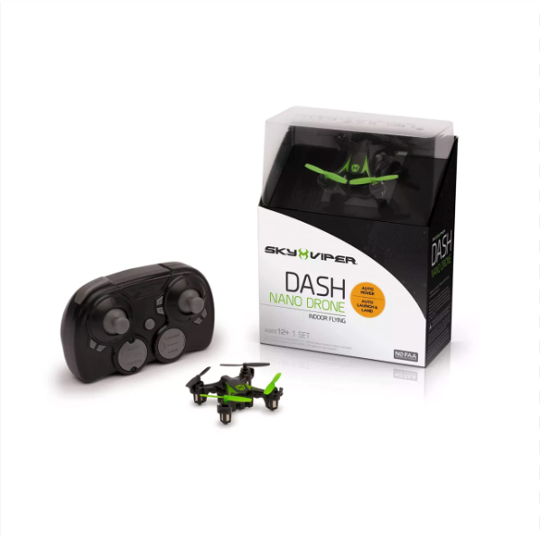

# off-the-shelf-drone-control 
Interfaced an inexpensive drone($18) with Arduino in order to control drone inputs through Arduino IDE.
# Initial Steps: 
* Received the drone (sky viper nano) and Arduino Uno kit
* Installed arduino IDE (integrated development environment) on my laptop
* Tested the drone

[The Sky Viper Nano drone is a lightweight mini drone](https://www.amazon.com/Sky-Viper-Drone-Black-Green/dp/B07G1RJXGF)
